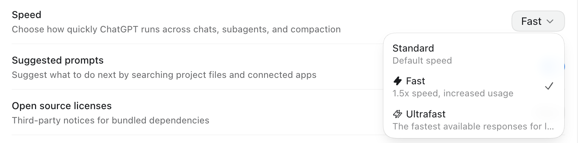

# Codex Fast Switch

[English](README.en.md)

让使用 **API Key 或中转服务** 的 Codex 桌面端也能使用原生 **Standard / Fast** 开关，包括设置页和会话内的模型菜单。支持 macOS、Windows，以及 App 更新后的兼容补丁自动应用。

补丁开启的是客户端已有的控件，不提供 OAuth 登录、订阅或优先处理额度。Fast 请求发送 `service_tier: "priority"`，实际速度和费用取决于模型与服务商支持。

## 界面预览

原生 Speed 菜单与会话模型控件，截图来自 macOS App 26.901.41600：




## 一键安装

先安装官方 Codex 桌面端。以下命令用于安装或升级，会自动应用补丁、开启更新监控，并在需要时正常退出和重开 App。

### macOS

在终端执行：

```sh
curl -fsSL https://github.com/infinityf4p/codex-fast-switch/releases/latest/download/install.sh | /bin/sh
```

安装后继续从原来的 App 图标启动。首次切换到本地签名时，若出现 `Codex Storage Key` 钥匙串提示，请选择“始终允许”；后续补丁复用同一张本机证书。[签名说明](docs/local-signing.md)

### Windows

在 PowerShell 执行：

```powershell
& { $fastInstaller = Join-Path $env:TEMP 'codex-fast-install.cmd'; Invoke-WebRequest 'https://github.com/infinityf4p/codex-fast-switch/releases/latest/download/install.cmd' -OutFile $fastInstaller -UseBasicParsing -ErrorAction Stop; & $fastInstaller }
```

也可以直接下载并双击 [install.cmd](https://github.com/infinityf4p/codex-fast-switch/releases/latest/download/install.cmd)，无需手动解压或安装 npm 依赖。

Windows 会创建并打开本地补丁副本，原开始菜单图标仍打开官方原版。之后可再次运行 `install.cmd` 打开副本，或使用 ZIP 包中的 `Open Codex Fast.cmd`。退出时使用 `Ctrl+Q` 或托盘菜单的 Quit，关闭窗口可能只是最小化到托盘。

## 怎么切换 Fast

| 操作位置 | 生效范围 |
| --- | --- |
| Settings > General > Speed | 设置新会话的默认速度，已有会话保持原选择 |
| 当前会话的模型菜单 | 开关该会话的 Fast，下一条消息生效，其他会话不受影响 |
| 回复正在生成时切换 | 已提交的请求保持原档位，下一条消息使用新选择 |

部分版本的会话内开关显示为 **More usage**。关闭 Fast 后，请求省略 `service_tier`，由服务商的默认策略决定处理档位。

上述会话行为依据 2026-09-05 的 Windows App **26.901.41600 (7982)**、补丁 revision 2、`gpt-6-astra` 九次普通回复测试，包括一次生成中切换；尚未覆盖工具调用回合中的后续模型请求，也不代表速度或计费保证。

## 其他安装方式

从 [Releases](https://github.com/infinityf4p/codex-fast-switch/releases/latest) 下载对应平台的 ZIP，解压后运行：

- **macOS：** `Install or Update.command`。
- **Windows：** 根目录的 `install.cmd`。

辅助脚本位于 `launchers/macos` 或 `launchers/windows`；旧版发布包放在根目录。`Apply and Restart` 用于单次应用并重开，`Check Status` 查看状态，`Disable Automatic Fast` 停止自动监控并保留已安装的补丁。

## 源码安装与编译

需要 Git、Node.js **22.12+**。macOS 还需 Xcode Command Line Tools（`xcode-select --install`）；Windows 无需另外安装编译器。

```sh
git clone https://github.com/infinityf4p/codex-fast-switch.git
cd codex-fast-switch
npm ci --ignore-scripts
npm run build
node cli.cjs setup
```

`node cli.cjs doctor` 只检查兼容性，`node cli.cjs status` 查看状态。自定义安装位置可使用 `node cli.cjs setup --app "应用路径"`。

检查、测试和生成当前平台的发布包：

```sh
npm run check
npm test
npm run package
```

## 恢复与支持范围

- **macOS：** 退出 App 后运行 `Restore Original App.command`，或在源码目录执行 `node cli.cjs restore`，停用监控并恢复原版。不要提前删除原版备份或本地签名文件。
- **Windows：** 下载并运行 [uninstall.cmd](https://github.com/infinityf4p/codex-fast-switch/releases/latest/download/uninstall.cmd)，或执行 `node cli.cjs uninstall`，移除补丁副本与监控，保留 Codex 的个人配置和会话。
- macOS 要求 13+ 和支持克隆的 APFS；Windows 要求 Windows 10 2004+ / 11 及兼容的 Owl 客户端。官方 App 自身的系统要求仍然适用。已实测 Apple Silicon 和 Windows x64，Intel Mac、Windows ARM64 尚未验证，Linux 不支持安装。
- 后续 App 更新在退出后自动适配；无法识别的新版本会停止修改并报告问题，需要更新本项目。不保证兼容所有未来版本。
- macOS 使用本地证书重签名，Windows 副本是未签名程序，可能受到系统权限或应用控制策略限制。安装过程不调用模型 API，也不修改中转站配置。

更多说明：[Windows](docs/windows.md) · [验证方式](docs/validation.md) · [测试记录](docs/tested-builds.md) · [安全说明](SECURITY.md)。

本项目由 infinityf4p 维护，采用 [MIT](LICENSE) 协议，与 OpenAI 无隶属关系。[第三方许可](THIRD_PARTY_NOTICES.md)
